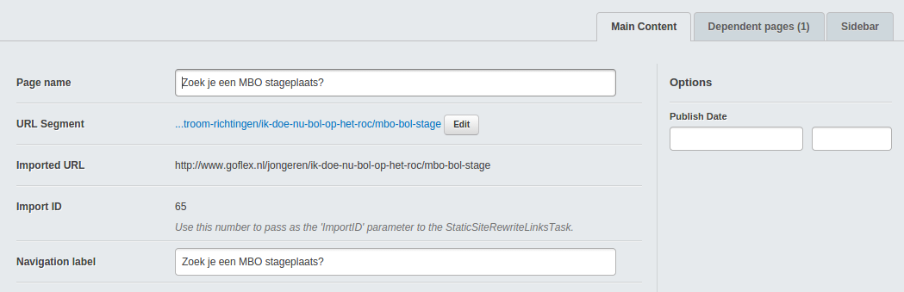
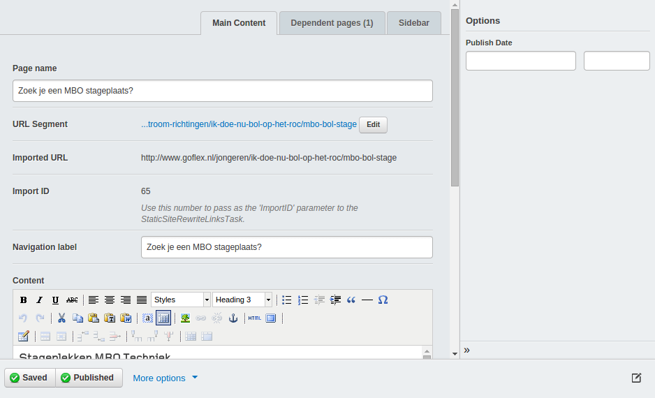

Silverstripe CMS Right Sidebar
==============================

Allows adding a right-hand sidebar in the CMS to hold options/fields for the currently edited record. Abstracted out from the Silverstripe Blog module for use on other pages as well (blog module by ao. Michael Strong/Silverstripe)

Usage (in getCMSfields):

```php

	$options = RightSidebar::create(
		$publishDate = DatetimeField::create("PublishDate", "Publish Date"),
		TagField::create(
			'Categories',
			'Categories',
			$self->Parent()->Categories()->map(),
			$self->Categories()->map(),
			!$self->canCreateCategories()
		),
		TagField::create(
			'Tags',
			'Tags',
			$self->Parent()->Tags()->map(),
			$self->Tags()->map(),
			!$self->canCreateTags()
		)
	);

	// Add to Main tab (fixed width) and render an outer template to deal with our custom layout
	$fields->addFieldsToTab('Root.Main', $options);
	$fields->fieldByName('Root')->setTemplate('RightSidebarInnerTabSet');

	// OR: Add it full-screen (collapsible) and render an outer template to deal with our custom layout
	$fields->insertBefore($options, 'Root');
	$fields->fieldByName('Root')->setTemplate('RightSidebarTabSet');

```

## Screenshots

*Inside a tab (fixed-width/non-collapsible)*



*Full screen (collapsible/expandable)*

